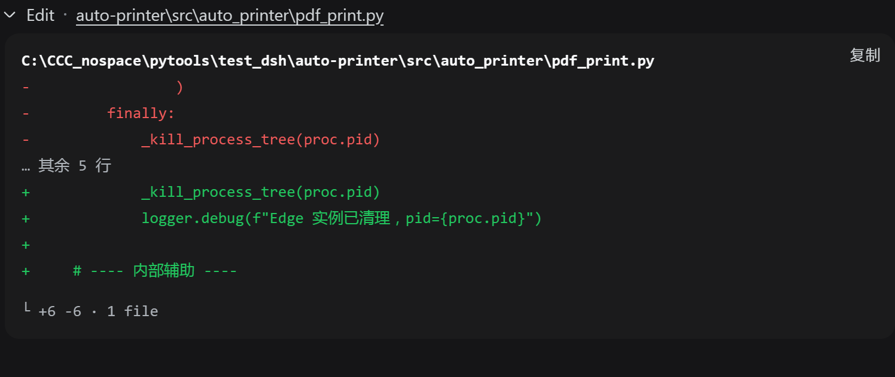
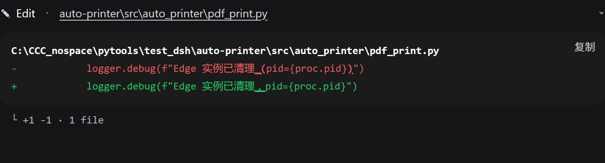

# dsh·修改显示优化插件

接管 DSH 浏览器的 `edit` / `write` 工具卡片，用近线性行级 diff 做真正的差异展示，消除内置 DiffBlock 把「未变化的相同行」在删除区红 `-` 行和新增区绿 `+` 行各渲染一遍的重复。

纯浏览器端 client 插件，单击即换新渲染，不碰 DSH 源码。

## 引言

原版 diff 的显示相当离谱：一次只修改一行，它却把这行连同上下各三行一起带进 diff，共十四行，其中七行被折叠，正好红区和绿区完全不重叠。不点开二级展开根本看不出到底改了什么——点开了也照样看花眼。

这个插件把无关的相同行全部去除。只修改一行时，就只显示一行红一行绿，真正的修改加粗划线，一眼就能看清改在哪里。

另外，PTC 模式下默认只显示调用成功与否，本插件也做了适配，能正常显示修改内容。

## 功能

- **仅差异行**：完全相同行直接不渲染，只显示真实变化的删除行红 `-` 与新增行绿 `+`，消除重复。
- **行内字符高亮**：删/增行数相等的替换对，再做字符级 diff，用下划线在行内标出真正改动的字符，而不是整行糊在一起。
- **近线性算法**：先做公共前缀/后缀收缩线性，仅对中间小差异带运行 Myers diff，复杂度与差异量成正比而非平方，超大文件也流畅。
- **默认收起**：卡片默认一行摘要，点开才显示 diff 体，不刷屏。
- **长 diff 二次折叠**：展开后若差异行超 14 行，折成头 +「⋯ 展开其余 N 行差异」+ 尾，点开才全量。
- **对齐原生观感**：字号、圆角、配色复用内置 DiffBlock/ToolRow 同一批 `--dsw-*` 主题变量，视觉上就是原生卡片。
- **复制与统计**：复制只含差异行，`- `/`+ ` 前缀；底部 `└ +A -R · N file(s)` 变更统计。
- **单文件与多文件**：`edit` / `write` 双双接管，覆盖新建只显示绿色新增，纯删、多 hunk 等场景。
- **PTC 模式兼容**：`run_code` 子调用中的 `edit` / `write` 同样显示优化后的修改 diff，通过 `callId` 中的 `:code:` 标记识别子调用。注意 `write` 是全文件覆写，无旧内容，只能显示全新增；想看精确 diff 应使用 `edit`。

## 它长什么样

|  | 效果图 |
| --- | --- |
| 原版 diff |  |
| 本插件 |  |

## 演示视频

光看静态截图不过瘾？看看这个插件的实际演示效果：

| dsh-edit-diff 插件演示 · 66 秒 |
| :---: |
| [](https://www.bilibili.com/video/BV1ect76CENM/) |

## 安装

**从 GitHub 安装**：源码在 `src/`，`lib/` 不入仓库，安装时 npm 会触发 `prepare` 脚本现场构建。

```powershell
dsh plugin --profile web add github:better-er/dsh-edit-diff
```

**从 npm 安装**：包内已含构建产物 `lib/index.js` 与 `lib/client.js`，安装时不再构建。

```powershell
dsh plugin --profile web add dsh-edit-diff
```

两种方式装完都会自动挂载，重启 DSH web 后启用，无需手工编辑任何文件。

## 卸载

```powershell
dsh plugin --profile web remove dsh-edit-diff
```

彻底移除，重启 DSH web 后不再加载。

## 要求与开发

- 是**标准形态的 dsh client 插件**，声明 `dsh.client`，导出 `./client`。
- 同时声明了 `dsh.bundle`，因此也是一个**自挂载的 bundle 层插件**：用 `dsh plugin --profile <name> add` 从 GitHub 安装后，会被自动识别为 profile layer 并挂载，无需手工写组合 entry。
- 纯浏览器半身，无 host 行为；`lib/index.js` 是无操作的 no-op 主机插件标准双面包约定。
- **UI 挂载点**：接管 keyed 槽位 `tool.call.toolview` 的 `edit` 与 `write` 两个 key。
- **遮蔽而非冲突**：注册时显式传 `priority: -1`低于内置 `file-mutation-toolview` 的默认 0，用更低优先级遮蔽默认渲染，而不是在同一优先级上 clash。
- **PTC 模式**：通过 `callId` 包含 `:code:` 判断是否为 `run_code` 子调用，从 `argsRaw` 中提取 `old_string`/`new_string` 即 edit 或 `content` 即 write 动态构建 diff。
- **构建型**：TypeScript 源码位于 `src/`，`pnpm build` 通过 tsdown 生成 `lib/index.js`、`lib/index.d.ts`、`lib/client.js` 与 sourcemap，运行时只加载 `lib/` 发布产物。
- 无运行时 npm 依赖，diff 算法就地内联；浏览器端只向宿主模块表请求 react。

本地开发：

```powershell
pnpm install
pnpm typecheck
pnpm build
```

改完源码需重新 `pnpm build`，DSH web 的 HMR 观察到 `lib/client.js` 变化后自动重载。

## License

[MIT](./LICENSE)
