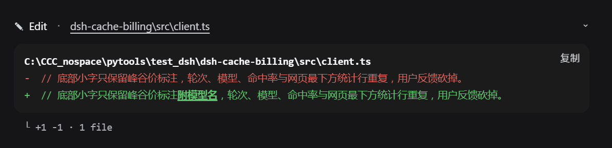

# dsh·去重复 diff 展示插件

接管 DSH 浏览器的 `edit` / `write` 工具卡片，用近线性行级 diff 做真正的差异展示，消除内置 DiffBlock 把「未变化的相同行」在删除区红 `-` 行和新增区绿 `+` 行各渲染一遍的重复。

纯浏览器端 client 插件，单击即换新渲染，不碰 DSH 源码。

## 引言

DeepSeek Harness 内置的 DiffBlock 展示工具改动时有个毛病：它拿到旧文件全文和新文件全文，就把旧的全染成红色 `-` 行、新的全染成绿色 `+` 行——**完全不做行级匹配**。

结果呢？一次只改了一小段的 edit，一堆根本没变的注释、空行、样板代码，在红绿两区各出现一遍，仿佛同一句话被说了两次。大文件改起来更是重复加刷屏，想扫一眼真正改了什么，得靠肉眼在一大摊重复里找不同。

这哪行。改个文件就该像看 git diff 一样：**只亮出真正的差异，相同行不该凑热闹**。

于是这个插件接管了 `edit` 和 `write` 两个工具卡片，用近线性算法算出真实差异，相同行一行不渲染，替换行还把改动到的具体字符用下划线标出来。一眼就知道到底改了什么。

## 功能

- **仅差异行**：完全相同行直接不渲染，只显示真实变化的删除行红 `-` 与新增行绿 `+`，消除重复。
- **行内字符高亮**：删/增行数相等的替换对，再做字符级 diff，用下划线在行内标出真正改动的字符，而不是整行糊在一起。
- **近线性算法**：先做公共前缀/后缀收缩线性，仅对中间小差异带运行 Myers diff，复杂度与差异量成正比而非平方，超大文件也流畅。
- **默认收起**：卡片默认一行摘要，点开才显示 diff 体，不刷屏。
- **长 diff 二次折叠**：展开后若差异行超 14 行，折成头 +「⋯ 展开其余 N 行差异」+ 尾，点开才全量。
- **对齐原生观感**：字号、圆角、配色复用内置 DiffBlock/ToolRow 同一批 `--dsw-*` 主题变量，视觉上就是原生卡片。
- **复制与统计**：复制只含差异行，`- `/`+ ` 前缀；底部 `└ +A -R · N file(s)` 变更统计。
- **单文件与多文件**：`edit` / `write` 双双接管，覆盖新建只显示绿色新增，纯删、多 hunk 等场景。
- **PTC 模式兼容**：`run_code` 子调用中的 `edit` / `write` 同样显示去重 diff，通过 `callId` 中的 `:code:` 标记识别子调用。注意 `write` 是全文件覆写，无旧内容，只能显示全新增；想看精确 diff 应使用 `edit`。

## 它长什么样

`edit` 只改动一小段后的实际效果：



- **顶部行**：`✎ Edit · dsh-cache-billing\src\client.ts`，右侧 chevron 可点开收起。
- **diff 体**：只显示真实变化的删除行红色 `-` 与新增行绿色 `+`，完全相同行不重复渲染。
- **行内高亮**：把 `峰谷价标注` 改成 `峰谷价标注附模型名`，改动到的字符 `附模型名` 以下划线加粗标出；右下角为复制按钮。
- **底部统计**：`└ +1 -1 · 1 file`，列明净增删行数与文件数。

## 安装

```powershell
dsh plugin --profile web add github:better-er/dsh-edit-diff
```

或安装 npm 发布的版本：`dsh plugin --profile web add dsh-edit-diff`。

一条命令装完即生效，自动挂载，重启 DSH web 后启用，无需手工编辑任何组合文件。

## 卸载

```powershell
dsh plugin --profile web remove dsh-edit-diff
```

彻底移除，重启 DSH web 后不再加载。

## 要求与开发

- 是**标准形态的 dsh client 插件**，声明 `dsh.client`，导出 `./client`。
- 同时声明了 `dsh.bundle`，因此也是一个**自挂载的 bundle 层插件**：用 `dsh plugin --profile <name> add` 从 GitHub 安装后，会被自动识别为 profile layer 并挂载，无需手工写组合 entry。
- 纯浏览器半身，无 host 行为；`lib/index.js` 是无操作的 no-op 主机插件标准双面包约定。
- **UI 挂载点**：接管 keyed 槽位 `tool.call.toolview` 的 `edit` 与 `write` 两个 key。
- **遮蔽而非冲突**：注册时显式传 `priority: -1`低于内置 `file-mutation-toolview` 的默认 0，用更低优先级遮蔽默认渲染，而不是在同一优先级上 clash。
- **PTC 模式**：通过 `callId` 包含 `:code:` 判断是否为 `run_code` 子调用，从 `argsRaw` 中提取 `old_string`/`new_string` 即 edit 或 `content` 即 write 动态构建 diff。
- **无构建**：`lib/client.js` 是按 DSH client bundle 产出的注册式模块，源码即产物，改完即用。
- 纯 JavaScript 单文件，不引入任何额外 npm 依赖diff 算法就地内联。

## License

[MIT](./LICENSE)